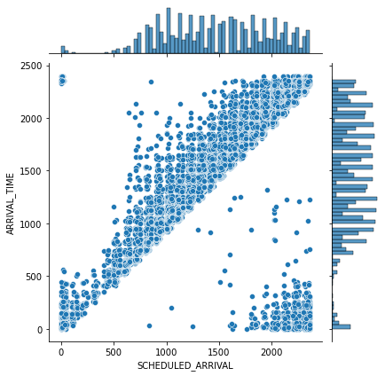
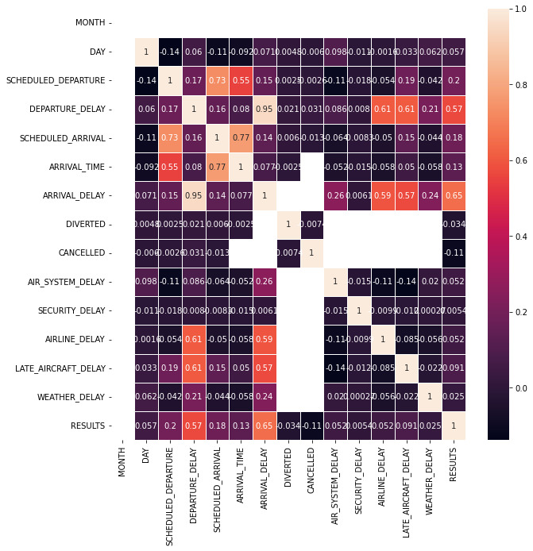

```python
import pandas as pd
import numpy as np
import seaborn as sb
from sklearn.model_selection import train_test_split
from sklearn.preprocessing import StandardScaler
from sklearn.tree import DecisionTreeClassifier
from sklearn.metrics import roc_auc_score
```


```python
df_airlines = pd.read_csv('airlines.csv')
df_airlines
```


<div>
<style scoped>
    .dataframe tbody tr th:only-of-type {
        vertical-align: middle;
    }

    .dataframe tbody tr th {
        vertical-align: top;
    }

    .dataframe thead th {
        text-align: right;
    }
</style>
<table border="1" class="dataframe">
  <thead>
    <tr style="text-align: right;">
      <th></th>
      <th>IATA_CODE</th>
      <th>AIRLINE</th>
    </tr>
  </thead>
  <tbody>
    <tr>
      <th>0</th>
      <td>UA</td>
      <td>United Air Lines Inc.</td>
    </tr>
    <tr>
      <th>1</th>
      <td>AA</td>
      <td>American Airlines Inc.</td>
    </tr>
    <tr>
      <th>2</th>
      <td>US</td>
      <td>US Airways Inc.</td>
    </tr>
    <tr>
      <th>3</th>
      <td>F9</td>
      <td>Frontier Airlines Inc.</td>
    </tr>
    <tr>
      <th>4</th>
      <td>B6</td>
      <td>JetBlue Airways</td>
    </tr>
    <tr>
      <th>5</th>
      <td>OO</td>
      <td>Skywest Airlines Inc.</td>
    </tr>
    <tr>
      <th>6</th>
      <td>AS</td>
      <td>Alaska Airlines Inc.</td>
    </tr>
    <tr>
      <th>7</th>
      <td>NK</td>
      <td>Spirit Air Lines</td>
    </tr>
    <tr>
      <th>8</th>
      <td>WN</td>
      <td>Southwest Airlines Co.</td>
    </tr>
    <tr>
      <th>9</th>
      <td>DL</td>
      <td>Delta Air Lines Inc.</td>
    </tr>
    <tr>
      <th>10</th>
      <td>EV</td>
      <td>Atlantic Southeast Airlines</td>
    </tr>
    <tr>
      <th>11</th>
      <td>HA</td>
      <td>Hawaiian Airlines Inc.</td>
    </tr>
    <tr>
      <th>12</th>
      <td>MQ</td>
      <td>American Eagle Airlines Inc.</td>
    </tr>
    <tr>
      <th>13</th>
      <td>VX</td>
      <td>Virgin America</td>
    </tr>
  </tbody>
</table>
</div>


```python
df_airports = pd.read_csv('airports.csv')
df_airports
```


<div>
<style scoped>
    .dataframe tbody tr th:only-of-type {
        vertical-align: middle;
    }

    .dataframe tbody tr th {
        vertical-align: top;
    }

    .dataframe thead th {
        text-align: right;
    }
</style>
<table border="1" class="dataframe">
  <thead>
    <tr style="text-align: right;">
      <th></th>
      <th>IATA_CODE</th>
      <th>AIRPORT</th>
      <th>CITY</th>
      <th>STATE</th>
      <th>COUNTRY</th>
      <th>LATITUDE</th>
      <th>LONGITUDE</th>
    </tr>
  </thead>
  <tbody>
    <tr>
      <th>0</th>
      <td>ABE</td>
      <td>Lehigh Valley International Airport</td>
      <td>Allentown</td>
      <td>PA</td>
      <td>USA</td>
      <td>40.65236</td>
      <td>-75.44040</td>
    </tr>
    <tr>
      <th>1</th>
      <td>ABI</td>
      <td>Abilene Regional Airport</td>
      <td>Abilene</td>
      <td>TX</td>
      <td>USA</td>
      <td>32.41132</td>
      <td>-99.68190</td>
    </tr>
    <tr>
      <th>2</th>
      <td>ABQ</td>
      <td>Albuquerque International Sunport</td>
      <td>Albuquerque</td>
      <td>NM</td>
      <td>USA</td>
      <td>35.04022</td>
      <td>-106.60919</td>
    </tr>
    <tr>
      <th>3</th>
      <td>ABR</td>
      <td>Aberdeen Regional Airport</td>
      <td>Aberdeen</td>
      <td>SD</td>
      <td>USA</td>
      <td>45.44906</td>
      <td>-98.42183</td>
    </tr>
    <tr>
      <th>4</th>
      <td>ABY</td>
      <td>Southwest Georgia Regional Airport</td>
      <td>Albany</td>
      <td>GA</td>
      <td>USA</td>
      <td>31.53552</td>
      <td>-84.19447</td>
    </tr>
    <tr>
      <th>...</th>
      <td>...</td>
      <td>...</td>
      <td>...</td>
      <td>...</td>
      <td>...</td>
      <td>...</td>
      <td>...</td>
    </tr>
    <tr>
      <th>317</th>
      <td>WRG</td>
      <td>Wrangell Airport</td>
      <td>Wrangell</td>
      <td>AK</td>
      <td>USA</td>
      <td>56.48433</td>
      <td>-132.36982</td>
    </tr>
    <tr>
      <th>318</th>
      <td>WYS</td>
      <td>Westerly State Airport</td>
      <td>West Yellowstone</td>
      <td>MT</td>
      <td>USA</td>
      <td>44.68840</td>
      <td>-111.11764</td>
    </tr>
    <tr>
      <th>319</th>
      <td>XNA</td>
      <td>Northwest Arkansas Regional Airport</td>
      <td>Fayetteville/Springdale/Rogers</td>
      <td>AR</td>
      <td>USA</td>
      <td>36.28187</td>
      <td>-94.30681</td>
    </tr>
    <tr>
      <th>320</th>
      <td>YAK</td>
      <td>Yakutat Airport</td>
      <td>Yakutat</td>
      <td>AK</td>
      <td>USA</td>
      <td>59.50336</td>
      <td>-139.66023</td>
    </tr>
    <tr>
      <th>321</th>
      <td>YUM</td>
      <td>Yuma International Airport</td>
      <td>Yuma</td>
      <td>AZ</td>
      <td>USA</td>
      <td>32.65658</td>
      <td>-114.60597</td>
    </tr>
  </tbody>
</table>
<p>322 rows × 7 columns</p>
</div>


```python
df_airports_dict = df_airports.iloc[:,:2]
df_airports_dict = df_airports_dict.to_dict(orient = 'records')
df_airports_dict
```


<div>
<style scoped>
    .dataframe tbody tr th:only-of-type {
        vertical-align: middle;
    }

    .dataframe tbody tr th {
        vertical-align: top;
    }

    .dataframe thead th {
        text-align: right;
    }
</style>
<table border="1" class="dataframe">
  <thead>
    <tr style="text-align: right;">
      <th></th>
      <th>IATA_CODE</th>
      <th>AIRPORT</th>
    </tr>
  </thead>
  <tbody>
    <tr>
      <th>0</th>
      <td>ABE</td>
      <td>Lehigh Valley International Airport</td>
    </tr>
    <tr>
      <th>1</th>
      <td>ABI</td>
      <td>Abilene Regional Airport</td>
    </tr>
    <tr>
      <th>2</th>
      <td>ABQ</td>
      <td>Albuquerque International Sunport</td>
    </tr>
    <tr>
      <th>3</th>
      <td>ABR</td>
      <td>Aberdeen Regional Airport</td>
    </tr>
    <tr>
      <th>4</th>
      <td>ABY</td>
      <td>Southwest Georgia Regional Airport</td>
    </tr>
    <tr>
      <th>...</th>
      <td>...</td>
      <td>...</td>
    </tr>
    <tr>
      <th>317</th>
      <td>WRG</td>
      <td>Wrangell Airport</td>
    </tr>
    <tr>
      <th>318</th>
      <td>WYS</td>
      <td>Westerly State Airport</td>
    </tr>
    <tr>
      <th>319</th>
      <td>XNA</td>
      <td>Northwest Arkansas Regional Airport</td>
    </tr>
    <tr>
      <th>320</th>
      <td>YAK</td>
      <td>Yakutat Airport</td>
    </tr>
    <tr>
      <th>321</th>
      <td>YUM</td>
      <td>Yuma International Airport</td>
    </tr>
  </tbody>
</table>
<p>322 rows × 2 columns</p>
</div>


```python

```


```python
df_flights = pd.read_csv('flights.csv')
df_flights
```


<div>
<style scoped>
    .dataframe tbody tr th:only-of-type {
        vertical-align: middle;
    }

    .dataframe tbody tr th {
        vertical-align: top;
    }

    .dataframe thead th {
        text-align: right;
    }
</style>
<table border="1" class="dataframe">
  <thead>
    <tr style="text-align: right;">
      <th></th>
      <th>YEAR</th>
      <th>MONTH</th>
      <th>DAY</th>
      <th>DAY_OF_WEEK</th>
      <th>AIRLINE</th>
      <th>FLIGHT_NUMBER</th>
      <th>TAIL_NUMBER</th>
      <th>ORIGIN_AIRPORT</th>
      <th>DESTINATION_AIRPORT</th>
      <th>SCHEDULED_DEPARTURE</th>
      <th>...</th>
      <th>ARRIVAL_TIME</th>
      <th>ARRIVAL_DELAY</th>
      <th>DIVERTED</th>
      <th>CANCELLED</th>
      <th>CANCELLATION_REASON</th>
      <th>AIR_SYSTEM_DELAY</th>
      <th>SECURITY_DELAY</th>
      <th>AIRLINE_DELAY</th>
      <th>LATE_AIRCRAFT_DELAY</th>
      <th>WEATHER_DELAY</th>
    </tr>
  </thead>
  <tbody>
    <tr>
      <th>0</th>
      <td>2015</td>
      <td>1</td>
      <td>1</td>
      <td>4</td>
      <td>AS</td>
      <td>98</td>
      <td>N407AS</td>
      <td>ANC</td>
      <td>SEA</td>
      <td>5</td>
      <td>...</td>
      <td>408.0</td>
      <td>-22.0</td>
      <td>0</td>
      <td>0</td>
      <td>NaN</td>
      <td>NaN</td>
      <td>NaN</td>
      <td>NaN</td>
      <td>NaN</td>
      <td>NaN</td>
    </tr>
    <tr>
      <th>1</th>
      <td>2015</td>
      <td>1</td>
      <td>1</td>
      <td>4</td>
      <td>AA</td>
      <td>2336</td>
      <td>N3KUAA</td>
      <td>LAX</td>
      <td>PBI</td>
      <td>10</td>
      <td>...</td>
      <td>741.0</td>
      <td>-9.0</td>
      <td>0</td>
      <td>0</td>
      <td>NaN</td>
      <td>NaN</td>
      <td>NaN</td>
      <td>NaN</td>
      <td>NaN</td>
      <td>NaN</td>
    </tr>
    <tr>
      <th>2</th>
      <td>2015</td>
      <td>1</td>
      <td>1</td>
      <td>4</td>
      <td>US</td>
      <td>840</td>
      <td>N171US</td>
      <td>SFO</td>
      <td>CLT</td>
      <td>20</td>
      <td>...</td>
      <td>811.0</td>
      <td>5.0</td>
      <td>0</td>
      <td>0</td>
      <td>NaN</td>
      <td>NaN</td>
      <td>NaN</td>
      <td>NaN</td>
      <td>NaN</td>
      <td>NaN</td>
    </tr>
    <tr>
      <th>3</th>
      <td>2015</td>
      <td>1</td>
      <td>1</td>
      <td>4</td>
      <td>AA</td>
      <td>258</td>
      <td>N3HYAA</td>
      <td>LAX</td>
      <td>MIA</td>
      <td>20</td>
      <td>...</td>
      <td>756.0</td>
      <td>-9.0</td>
      <td>0</td>
      <td>0</td>
      <td>NaN</td>
      <td>NaN</td>
      <td>NaN</td>
      <td>NaN</td>
      <td>NaN</td>
      <td>NaN</td>
    </tr>
    <tr>
      <th>4</th>
      <td>2015</td>
      <td>1</td>
      <td>1</td>
      <td>4</td>
      <td>AS</td>
      <td>135</td>
      <td>N527AS</td>
      <td>SEA</td>
      <td>ANC</td>
      <td>25</td>
      <td>...</td>
      <td>259.0</td>
      <td>-21.0</td>
      <td>0</td>
      <td>0</td>
      <td>NaN</td>
      <td>NaN</td>
      <td>NaN</td>
      <td>NaN</td>
      <td>NaN</td>
      <td>NaN</td>
    </tr>
    <tr>
      <th>...</th>
      <td>...</td>
      <td>...</td>
      <td>...</td>
      <td>...</td>
      <td>...</td>
      <td>...</td>
      <td>...</td>
      <td>...</td>
      <td>...</td>
      <td>...</td>
      <td>...</td>
      <td>...</td>
      <td>...</td>
      <td>...</td>
      <td>...</td>
      <td>...</td>
      <td>...</td>
      <td>...</td>
      <td>...</td>
      <td>...</td>
      <td>...</td>
    </tr>
    <tr>
      <th>5819074</th>
      <td>2015</td>
      <td>12</td>
      <td>31</td>
      <td>4</td>
      <td>B6</td>
      <td>688</td>
      <td>N657JB</td>
      <td>LAX</td>
      <td>BOS</td>
      <td>2359</td>
      <td>...</td>
      <td>753.0</td>
      <td>-26.0</td>
      <td>0</td>
      <td>0</td>
      <td>NaN</td>
      <td>NaN</td>
      <td>NaN</td>
      <td>NaN</td>
      <td>NaN</td>
      <td>NaN</td>
    </tr>
    <tr>
      <th>5819075</th>
      <td>2015</td>
      <td>12</td>
      <td>31</td>
      <td>4</td>
      <td>B6</td>
      <td>745</td>
      <td>N828JB</td>
      <td>JFK</td>
      <td>PSE</td>
      <td>2359</td>
      <td>...</td>
      <td>430.0</td>
      <td>-16.0</td>
      <td>0</td>
      <td>0</td>
      <td>NaN</td>
      <td>NaN</td>
      <td>NaN</td>
      <td>NaN</td>
      <td>NaN</td>
      <td>NaN</td>
    </tr>
    <tr>
      <th>5819076</th>
      <td>2015</td>
      <td>12</td>
      <td>31</td>
      <td>4</td>
      <td>B6</td>
      <td>1503</td>
      <td>N913JB</td>
      <td>JFK</td>
      <td>SJU</td>
      <td>2359</td>
      <td>...</td>
      <td>432.0</td>
      <td>-8.0</td>
      <td>0</td>
      <td>0</td>
      <td>NaN</td>
      <td>NaN</td>
      <td>NaN</td>
      <td>NaN</td>
      <td>NaN</td>
      <td>NaN</td>
    </tr>
    <tr>
      <th>5819077</th>
      <td>2015</td>
      <td>12</td>
      <td>31</td>
      <td>4</td>
      <td>B6</td>
      <td>333</td>
      <td>N527JB</td>
      <td>MCO</td>
      <td>SJU</td>
      <td>2359</td>
      <td>...</td>
      <td>330.0</td>
      <td>-10.0</td>
      <td>0</td>
      <td>0</td>
      <td>NaN</td>
      <td>NaN</td>
      <td>NaN</td>
      <td>NaN</td>
      <td>NaN</td>
      <td>NaN</td>
    </tr>
    <tr>
      <th>5819078</th>
      <td>2015</td>
      <td>12</td>
      <td>31</td>
      <td>4</td>
      <td>B6</td>
      <td>839</td>
      <td>N534JB</td>
      <td>JFK</td>
      <td>BQN</td>
      <td>2359</td>
      <td>...</td>
      <td>442.0</td>
      <td>2.0</td>
      <td>0</td>
      <td>0</td>
      <td>NaN</td>
      <td>NaN</td>
      <td>NaN</td>
      <td>NaN</td>
      <td>NaN</td>
      <td>NaN</td>
    </tr>
  </tbody>
</table>
<p>5819079 rows × 31 columns</p>
</div>


```python

```


```python
df_flights_100000 = df_flights.iloc[:100000,:]
df_flights_100000
```


<div>
<style scoped>
    .dataframe tbody tr th:only-of-type {
        vertical-align: middle;
    }

    .dataframe tbody tr th {
        vertical-align: top;
    }

    .dataframe thead th {
        text-align: right;
    }
</style>
<table border="1" class="dataframe">
  <thead>
    <tr style="text-align: right;">
      <th></th>
      <th>YEAR</th>
      <th>MONTH</th>
      <th>DAY</th>
      <th>DAY_OF_WEEK</th>
      <th>AIRLINE</th>
      <th>FLIGHT_NUMBER</th>
      <th>TAIL_NUMBER</th>
      <th>ORIGIN_AIRPORT</th>
      <th>DESTINATION_AIRPORT</th>
      <th>SCHEDULED_DEPARTURE</th>
      <th>...</th>
      <th>ARRIVAL_TIME</th>
      <th>ARRIVAL_DELAY</th>
      <th>DIVERTED</th>
      <th>CANCELLED</th>
      <th>CANCELLATION_REASON</th>
      <th>AIR_SYSTEM_DELAY</th>
      <th>SECURITY_DELAY</th>
      <th>AIRLINE_DELAY</th>
      <th>LATE_AIRCRAFT_DELAY</th>
      <th>WEATHER_DELAY</th>
    </tr>
  </thead>
  <tbody>
    <tr>
      <th>0</th>
      <td>2015</td>
      <td>1</td>
      <td>1</td>
      <td>4</td>
      <td>AS</td>
      <td>98</td>
      <td>N407AS</td>
      <td>ANC</td>
      <td>SEA</td>
      <td>5</td>
      <td>...</td>
      <td>408.0</td>
      <td>-22.0</td>
      <td>0</td>
      <td>0</td>
      <td>NaN</td>
      <td>NaN</td>
      <td>NaN</td>
      <td>NaN</td>
      <td>NaN</td>
      <td>NaN</td>
    </tr>
    <tr>
      <th>1</th>
      <td>2015</td>
      <td>1</td>
      <td>1</td>
      <td>4</td>
      <td>AA</td>
      <td>2336</td>
      <td>N3KUAA</td>
      <td>LAX</td>
      <td>PBI</td>
      <td>10</td>
      <td>...</td>
      <td>741.0</td>
      <td>-9.0</td>
      <td>0</td>
      <td>0</td>
      <td>NaN</td>
      <td>NaN</td>
      <td>NaN</td>
      <td>NaN</td>
      <td>NaN</td>
      <td>NaN</td>
    </tr>
    <tr>
      <th>2</th>
      <td>2015</td>
      <td>1</td>
      <td>1</td>
      <td>4</td>
      <td>US</td>
      <td>840</td>
      <td>N171US</td>
      <td>SFO</td>
      <td>CLT</td>
      <td>20</td>
      <td>...</td>
      <td>811.0</td>
      <td>5.0</td>
      <td>0</td>
      <td>0</td>
      <td>NaN</td>
      <td>NaN</td>
      <td>NaN</td>
      <td>NaN</td>
      <td>NaN</td>
      <td>NaN</td>
    </tr>
    <tr>
      <th>3</th>
      <td>2015</td>
      <td>1</td>
      <td>1</td>
      <td>4</td>
      <td>AA</td>
      <td>258</td>
      <td>N3HYAA</td>
      <td>LAX</td>
      <td>MIA</td>
      <td>20</td>
      <td>...</td>
      <td>756.0</td>
      <td>-9.0</td>
      <td>0</td>
      <td>0</td>
      <td>NaN</td>
      <td>NaN</td>
      <td>NaN</td>
      <td>NaN</td>
      <td>NaN</td>
      <td>NaN</td>
    </tr>
    <tr>
      <th>4</th>
      <td>2015</td>
      <td>1</td>
      <td>1</td>
      <td>4</td>
      <td>AS</td>
      <td>135</td>
      <td>N527AS</td>
      <td>SEA</td>
      <td>ANC</td>
      <td>25</td>
      <td>...</td>
      <td>259.0</td>
      <td>-21.0</td>
      <td>0</td>
      <td>0</td>
      <td>NaN</td>
      <td>NaN</td>
      <td>NaN</td>
      <td>NaN</td>
      <td>NaN</td>
      <td>NaN</td>
    </tr>
    <tr>
      <th>...</th>
      <td>...</td>
      <td>...</td>
      <td>...</td>
      <td>...</td>
      <td>...</td>
      <td>...</td>
      <td>...</td>
      <td>...</td>
      <td>...</td>
      <td>...</td>
      <td>...</td>
      <td>...</td>
      <td>...</td>
      <td>...</td>
      <td>...</td>
      <td>...</td>
      <td>...</td>
      <td>...</td>
      <td>...</td>
      <td>...</td>
      <td>...</td>
    </tr>
    <tr>
      <th>99995</th>
      <td>2015</td>
      <td>1</td>
      <td>7</td>
      <td>3</td>
      <td>EV</td>
      <td>4992</td>
      <td>N837AS</td>
      <td>ATL</td>
      <td>BQK</td>
      <td>1108</td>
      <td>...</td>
      <td>1208.0</td>
      <td>-11.0</td>
      <td>0</td>
      <td>0</td>
      <td>NaN</td>
      <td>NaN</td>
      <td>NaN</td>
      <td>NaN</td>
      <td>NaN</td>
      <td>NaN</td>
    </tr>
    <tr>
      <th>99996</th>
      <td>2015</td>
      <td>1</td>
      <td>7</td>
      <td>3</td>
      <td>NK</td>
      <td>394</td>
      <td>N522NK</td>
      <td>LAS</td>
      <td>PHL</td>
      <td>1108</td>
      <td>...</td>
      <td>1844.0</td>
      <td>2.0</td>
      <td>0</td>
      <td>0</td>
      <td>NaN</td>
      <td>NaN</td>
      <td>NaN</td>
      <td>NaN</td>
      <td>NaN</td>
      <td>NaN</td>
    </tr>
    <tr>
      <th>99997</th>
      <td>2015</td>
      <td>1</td>
      <td>7</td>
      <td>3</td>
      <td>OO</td>
      <td>5606</td>
      <td>N582SW</td>
      <td>SFO</td>
      <td>BFL</td>
      <td>1108</td>
      <td>...</td>
      <td>1232.0</td>
      <td>7.0</td>
      <td>0</td>
      <td>0</td>
      <td>NaN</td>
      <td>NaN</td>
      <td>NaN</td>
      <td>NaN</td>
      <td>NaN</td>
      <td>NaN</td>
    </tr>
    <tr>
      <th>99998</th>
      <td>2015</td>
      <td>1</td>
      <td>7</td>
      <td>3</td>
      <td>UA</td>
      <td>1135</td>
      <td>N38473</td>
      <td>ORD</td>
      <td>MCO</td>
      <td>1109</td>
      <td>...</td>
      <td>1453.0</td>
      <td>-1.0</td>
      <td>0</td>
      <td>0</td>
      <td>NaN</td>
      <td>NaN</td>
      <td>NaN</td>
      <td>NaN</td>
      <td>NaN</td>
      <td>NaN</td>
    </tr>
    <tr>
      <th>99999</th>
      <td>2015</td>
      <td>1</td>
      <td>7</td>
      <td>3</td>
      <td>AA</td>
      <td>74</td>
      <td>N4XLAA</td>
      <td>HOU</td>
      <td>DFW</td>
      <td>1109</td>
      <td>...</td>
      <td>1212.0</td>
      <td>-8.0</td>
      <td>0</td>
      <td>0</td>
      <td>NaN</td>
      <td>NaN</td>
      <td>NaN</td>
      <td>NaN</td>
      <td>NaN</td>
      <td>NaN</td>
    </tr>
  </tbody>
</table>
<p>100000 rows × 31 columns</p>
</div>


```python
df_airlines = pd.read_csv('airlines.csv')
df_airlines
```


<div>
<style scoped>
    .dataframe tbody tr th:only-of-type {
        vertical-align: middle;
    }

    .dataframe tbody tr th {
        vertical-align: top;
    }

    .dataframe thead th {
        text-align: right;
    }
</style>
<table border="1" class="dataframe">
  <thead>
    <tr style="text-align: right;">
      <th></th>
      <th>IATA_CODE</th>
      <th>AIRLINE</th>
    </tr>
  </thead>
  <tbody>
    <tr>
      <th>0</th>
      <td>UA</td>
      <td>United Air Lines Inc.</td>
    </tr>
    <tr>
      <th>1</th>
      <td>AA</td>
      <td>American Airlines Inc.</td>
    </tr>
    <tr>
      <th>2</th>
      <td>US</td>
      <td>US Airways Inc.</td>
    </tr>
    <tr>
      <th>3</th>
      <td>F9</td>
      <td>Frontier Airlines Inc.</td>
    </tr>
    <tr>
      <th>4</th>
      <td>B6</td>
      <td>JetBlue Airways</td>
    </tr>
    <tr>
      <th>5</th>
      <td>OO</td>
      <td>Skywest Airlines Inc.</td>
    </tr>
    <tr>
      <th>6</th>
      <td>AS</td>
      <td>Alaska Airlines Inc.</td>
    </tr>
    <tr>
      <th>7</th>
      <td>NK</td>
      <td>Spirit Air Lines</td>
    </tr>
    <tr>
      <th>8</th>
      <td>WN</td>
      <td>Southwest Airlines Co.</td>
    </tr>
    <tr>
      <th>9</th>
      <td>DL</td>
      <td>Delta Air Lines Inc.</td>
    </tr>
    <tr>
      <th>10</th>
      <td>EV</td>
      <td>Atlantic Southeast Airlines</td>
    </tr>
    <tr>
      <th>11</th>
      <td>HA</td>
      <td>Hawaiian Airlines Inc.</td>
    </tr>
    <tr>
      <th>12</th>
      <td>MQ</td>
      <td>American Eagle Airlines Inc.</td>
    </tr>
    <tr>
      <th>13</th>
      <td>VX</td>
      <td>Virgin America</td>
    </tr>
  </tbody>
</table>
</div>


```python
def convert(dataframe, column):
    dataframe[column] = dataframe[column].apply(lambda x: x.replace("UA", "United Air Lines Inc."))
    dataframe[column] = dataframe[column].apply(lambda x: x.replace("AA", "American Airlines Inc."))
    dataframe[column] = dataframe[column].apply(lambda x: x.replace("US", "US Airways Inc."))
    dataframe[column] = dataframe[column].apply(lambda x: x.replace("F9", "Frontier Airlines Inc."))
    dataframe[column] = dataframe[column].apply(lambda x: x.replace("B6", "JetBlue Airways"))
    dataframe[column] = dataframe[column].apply(lambda x: x.replace("OO", "Skywest Airlines Inc."))
    dataframe[column] = dataframe[column].apply(lambda x: x.replace("AS", "Alaska Airlines Inc."))
    dataframe[column] = dataframe[column].apply(lambda x: x.replace("NK", "Spirit Air Lines"))
    dataframe[column] = dataframe[column].apply(lambda x: x.replace("WN", "Southwest Airlines Co."))
    dataframe[column] = dataframe[column].apply(lambda x: x.replace("DL", "Delta Air Lines Inc."))
    dataframe[column] = dataframe[column].apply(lambda x: x.replace("EV", "Atlantic Southeast Airlines"))
    dataframe[column] = dataframe[column].apply(lambda x: x.replace("HA", "Hawaiian Airlines Inc."))
    dataframe[column] = dataframe[column].apply(lambda x: x.replace("MQ", "American Eagle Airlines Inc."))
    dataframe[column] = dataframe[column].apply(lambda x: x.replace("VX", "Virgin America"))
    
convert(df_flights_100000, 'AIRLINE')
```

    <ipython-input-216-db7ddc828c7b>:2: SettingWithCopyWarning: 
    A value is trying to be set on a copy of a slice from a DataFrame.
    Try using .loc[row_indexer,col_indexer] = value instead
    
    See the caveats in the documentation: https://pandas.pydata.org/pandas-docs/stable/user_guide/indexing.html#returning-a-view-versus-a-copy
      dataframe[column] = dataframe[column].apply(lambda x: x.replace("UA", "United Air Lines Inc."))
    <ipython-input-216-db7ddc828c7b>:3: SettingWithCopyWarning: 
    A value is trying to be set on a copy of a slice from a DataFrame.
    Try using .loc[row_indexer,col_indexer] = value instead
    
    See the caveats in the documentation: https://pandas.pydata.org/pandas-docs/stable/user_guide/indexing.html#returning-a-view-versus-a-copy
      dataframe[column] = dataframe[column].apply(lambda x: x.replace("AA", "American Airlines Inc."))
    <ipython-input-216-db7ddc828c7b>:4: SettingWithCopyWarning: 
    A value is trying to be set on a copy of a slice from a DataFrame.
    Try using .loc[row_indexer,col_indexer] = value instead
    
    See the caveats in the documentation: https://pandas.pydata.org/pandas-docs/stable/user_guide/indexing.html#returning-a-view-versus-a-copy
      dataframe[column] = dataframe[column].apply(lambda x: x.replace("US", "US Airways Inc."))
    <ipython-input-216-db7ddc828c7b>:5: SettingWithCopyWarning: 
    A value is trying to be set on a copy of a slice from a DataFrame.
    Try using .loc[row_indexer,col_indexer] = value instead
    
    See the caveats in the documentation: https://pandas.pydata.org/pandas-docs/stable/user_guide/indexing.html#returning-a-view-versus-a-copy
      dataframe[column] = dataframe[column].apply(lambda x: x.replace("F9", "Frontier Airlines Inc."))
    <ipython-input-216-db7ddc828c7b>:6: SettingWithCopyWarning: 
    A value is trying to be set on a copy of a slice from a DataFrame.
    Try using .loc[row_indexer,col_indexer] = value instead
    
    See the caveats in the documentation: https://pandas.pydata.org/pandas-docs/stable/user_guide/indexing.html#returning-a-view-versus-a-copy
      dataframe[column] = dataframe[column].apply(lambda x: x.replace("B6", "JetBlue Airways"))
    <ipython-input-216-db7ddc828c7b>:7: SettingWithCopyWarning: 
    A value is trying to be set on a copy of a slice from a DataFrame.
    Try using .loc[row_indexer,col_indexer] = value instead
    
    See the caveats in the documentation: https://pandas.pydata.org/pandas-docs/stable/user_guide/indexing.html#returning-a-view-versus-a-copy
      dataframe[column] = dataframe[column].apply(lambda x: x.replace("OO", "Skywest Airlines Inc."))
    <ipython-input-216-db7ddc828c7b>:8: SettingWithCopyWarning: 
    A value is trying to be set on a copy of a slice from a DataFrame.
    Try using .loc[row_indexer,col_indexer] = value instead
    
    See the caveats in the documentation: https://pandas.pydata.org/pandas-docs/stable/user_guide/indexing.html#returning-a-view-versus-a-copy
      dataframe[column] = dataframe[column].apply(lambda x: x.replace("AS", "Alaska Airlines Inc."))
    <ipython-input-216-db7ddc828c7b>:9: SettingWithCopyWarning: 
    A value is trying to be set on a copy of a slice from a DataFrame.
    Try using .loc[row_indexer,col_indexer] = value instead
    
    See the caveats in the documentation: https://pandas.pydata.org/pandas-docs/stable/user_guide/indexing.html#returning-a-view-versus-a-copy
      dataframe[column] = dataframe[column].apply(lambda x: x.replace("NK", "Spirit Air Lines"))
    <ipython-input-216-db7ddc828c7b>:10: SettingWithCopyWarning: 
    A value is trying to be set on a copy of a slice from a DataFrame.
    Try using .loc[row_indexer,col_indexer] = value instead
    
    See the caveats in the documentation: https://pandas.pydata.org/pandas-docs/stable/user_guide/indexing.html#returning-a-view-versus-a-copy
      dataframe[column] = dataframe[column].apply(lambda x: x.replace("WN", "Southwest Airlines Co."))
    <ipython-input-216-db7ddc828c7b>:11: SettingWithCopyWarning: 
    A value is trying to be set on a copy of a slice from a DataFrame.
    Try using .loc[row_indexer,col_indexer] = value instead
    
    See the caveats in the documentation: https://pandas.pydata.org/pandas-docs/stable/user_guide/indexing.html#returning-a-view-versus-a-copy
      dataframe[column] = dataframe[column].apply(lambda x: x.replace("DL", "Delta Air Lines Inc."))
    <ipython-input-216-db7ddc828c7b>:12: SettingWithCopyWarning: 
    A value is trying to be set on a copy of a slice from a DataFrame.
    Try using .loc[row_indexer,col_indexer] = value instead
    
    See the caveats in the documentation: https://pandas.pydata.org/pandas-docs/stable/user_guide/indexing.html#returning-a-view-versus-a-copy
      dataframe[column] = dataframe[column].apply(lambda x: x.replace("EV", "Atlantic Southeast Airlines"))
    <ipython-input-216-db7ddc828c7b>:13: SettingWithCopyWarning: 
    A value is trying to be set on a copy of a slice from a DataFrame.
    Try using .loc[row_indexer,col_indexer] = value instead
    
    See the caveats in the documentation: https://pandas.pydata.org/pandas-docs/stable/user_guide/indexing.html#returning-a-view-versus-a-copy
      dataframe[column] = dataframe[column].apply(lambda x: x.replace("HA", "Hawaiian Airlines Inc."))
    <ipython-input-216-db7ddc828c7b>:14: SettingWithCopyWarning: 
    A value is trying to be set on a copy of a slice from a DataFrame.
    Try using .loc[row_indexer,col_indexer] = value instead
    
    See the caveats in the documentation: https://pandas.pydata.org/pandas-docs/stable/user_guide/indexing.html#returning-a-view-versus-a-copy
      dataframe[column] = dataframe[column].apply(lambda x: x.replace("MQ", "American Eagle Airlines Inc."))
    <ipython-input-216-db7ddc828c7b>:15: SettingWithCopyWarning: 
    A value is trying to be set on a copy of a slice from a DataFrame.
    Try using .loc[row_indexer,col_indexer] = value instead
    
    See the caveats in the documentation: https://pandas.pydata.org/pandas-docs/stable/user_guide/indexing.html#returning-a-view-versus-a-copy
      dataframe[column] = dataframe[column].apply(lambda x: x.replace("VX", "Virgin America"))
    


```python
for i in df_airports['IATA_CODE']:
    print('print(\"''dataframe[column] = dataframe[column].apply(lambda x: x.replace(''"''"',i,'",'',j'')')
```

    print("dataframe[column] = dataframe[column].apply(lambda x: x.replace("" ABE ",,j)
    print("dataframe[column] = dataframe[column].apply(lambda x: x.replace("" ABI ",,j)
    print("dataframe[column] = dataframe[column].apply(lambda x: x.replace("" ABQ ",,j)
    print("dataframe[column] = dataframe[column].apply(lambda x: x.replace("" ABR ",,j)
    print("dataframe[column] = dataframe[column].apply(lambda x: x.replace("" ABY ",,j)
    print("dataframe[column] = dataframe[column].apply(lambda x: x.replace("" ACK ",,j)
    print("dataframe[column] = dataframe[column].apply(lambda x: x.replace("" ACT ",,j)
    print("dataframe[column] = dataframe[column].apply(lambda x: x.replace("" ACV ",,j)
    print("dataframe[column] = dataframe[column].apply(lambda x: x.replace("" ACY ",,j)
    print("dataframe[column] = dataframe[column].apply(lambda x: x.replace("" ADK ",,j)
    print("dataframe[column] = dataframe[column].apply(lambda x: x.replace("" ADQ ",,j)
    print("dataframe[column] = dataframe[column].apply(lambda x: x.replace("" AEX ",,j)
    print("dataframe[column] = dataframe[column].apply(lambda x: x.replace("" AGS ",,j)
    print("dataframe[column] = dataframe[column].apply(lambda x: x.replace("" AKN ",,j)
    print("dataframe[column] = dataframe[column].apply(lambda x: x.replace("" ALB ",,j)
    print("dataframe[column] = dataframe[column].apply(lambda x: x.replace("" ALO ",,j)
    print("dataframe[column] = dataframe[column].apply(lambda x: x.replace("" AMA ",,j)
    print("dataframe[column] = dataframe[column].apply(lambda x: x.replace("" ANC ",,j)
    print("dataframe[column] = dataframe[column].apply(lambda x: x.replace("" APN ",,j)
    print("dataframe[column] = dataframe[column].apply(lambda x: x.replace("" ASE ",,j)
    print("dataframe[column] = dataframe[column].apply(lambda x: x.replace("" ATL ",,j)
    print("dataframe[column] = dataframe[column].apply(lambda x: x.replace("" ATW ",,j)
    print("dataframe[column] = dataframe[column].apply(lambda x: x.replace("" AUS ",,j)
    print("dataframe[column] = dataframe[column].apply(lambda x: x.replace("" AVL ",,j)
    print("dataframe[column] = dataframe[column].apply(lambda x: x.replace("" AVP ",,j)
    print("dataframe[column] = dataframe[column].apply(lambda x: x.replace("" AZO ",,j)
    print("dataframe[column] = dataframe[column].apply(lambda x: x.replace("" BDL ",,j)
    print("dataframe[column] = dataframe[column].apply(lambda x: x.replace("" BET ",,j)
    print("dataframe[column] = dataframe[column].apply(lambda x: x.replace("" BFL ",,j)
    print("dataframe[column] = dataframe[column].apply(lambda x: x.replace("" BGM ",,j)
    print("dataframe[column] = dataframe[column].apply(lambda x: x.replace("" BGR ",,j)
    print("dataframe[column] = dataframe[column].apply(lambda x: x.replace("" BHM ",,j)
    print("dataframe[column] = dataframe[column].apply(lambda x: x.replace("" BIL ",,j)
    print("dataframe[column] = dataframe[column].apply(lambda x: x.replace("" BIS ",,j)
    print("dataframe[column] = dataframe[column].apply(lambda x: x.replace("" BJI ",,j)
    print("dataframe[column] = dataframe[column].apply(lambda x: x.replace("" BLI ",,j)
    print("dataframe[column] = dataframe[column].apply(lambda x: x.replace("" BMI ",,j)
    print("dataframe[column] = dataframe[column].apply(lambda x: x.replace("" BNA ",,j)
    print("dataframe[column] = dataframe[column].apply(lambda x: x.replace("" BOI ",,j)
    print("dataframe[column] = dataframe[column].apply(lambda x: x.replace("" BOS ",,j)
    print("dataframe[column] = dataframe[column].apply(lambda x: x.replace("" BPT ",,j)
    print("dataframe[column] = dataframe[column].apply(lambda x: x.replace("" BQK ",,j)
    print("dataframe[column] = dataframe[column].apply(lambda x: x.replace("" BQN ",,j)
    print("dataframe[column] = dataframe[column].apply(lambda x: x.replace("" BRD ",,j)
    print("dataframe[column] = dataframe[column].apply(lambda x: x.replace("" BRO ",,j)
    print("dataframe[column] = dataframe[column].apply(lambda x: x.replace("" BRW ",,j)
    print("dataframe[column] = dataframe[column].apply(lambda x: x.replace("" BTM ",,j)
    print("dataframe[column] = dataframe[column].apply(lambda x: x.replace("" BTR ",,j)
    print("dataframe[column] = dataframe[column].apply(lambda x: x.replace("" BTV ",,j)
    print("dataframe[column] = dataframe[column].apply(lambda x: x.replace("" BUF ",,j)
    print("dataframe[column] = dataframe[column].apply(lambda x: x.replace("" BUR ",,j)
    print("dataframe[column] = dataframe[column].apply(lambda x: x.replace("" BWI ",,j)
    print("dataframe[column] = dataframe[column].apply(lambda x: x.replace("" BZN ",,j)
    print("dataframe[column] = dataframe[column].apply(lambda x: x.replace("" CAE ",,j)
    print("dataframe[column] = dataframe[column].apply(lambda x: x.replace("" CAK ",,j)
    print("dataframe[column] = dataframe[column].apply(lambda x: x.replace("" CDC ",,j)
    print("dataframe[column] = dataframe[column].apply(lambda x: x.replace("" CDV ",,j)
    print("dataframe[column] = dataframe[column].apply(lambda x: x.replace("" CEC ",,j)
    print("dataframe[column] = dataframe[column].apply(lambda x: x.replace("" CHA ",,j)
    print("dataframe[column] = dataframe[column].apply(lambda x: x.replace("" CHO ",,j)
    print("dataframe[column] = dataframe[column].apply(lambda x: x.replace("" CHS ",,j)
    print("dataframe[column] = dataframe[column].apply(lambda x: x.replace("" CID ",,j)
    print("dataframe[column] = dataframe[column].apply(lambda x: x.replace("" CIU ",,j)
    print("dataframe[column] = dataframe[column].apply(lambda x: x.replace("" CLD ",,j)
    print("dataframe[column] = dataframe[column].apply(lambda x: x.replace("" CLE ",,j)
    print("dataframe[column] = dataframe[column].apply(lambda x: x.replace("" CLL ",,j)
    print("dataframe[column] = dataframe[column].apply(lambda x: x.replace("" CLT ",,j)
    print("dataframe[column] = dataframe[column].apply(lambda x: x.replace("" CMH ",,j)
    print("dataframe[column] = dataframe[column].apply(lambda x: x.replace("" CMI ",,j)
    print("dataframe[column] = dataframe[column].apply(lambda x: x.replace("" CMX ",,j)
    print("dataframe[column] = dataframe[column].apply(lambda x: x.replace("" CNY ",,j)
    print("dataframe[column] = dataframe[column].apply(lambda x: x.replace("" COD ",,j)
    print("dataframe[column] = dataframe[column].apply(lambda x: x.replace("" COS ",,j)
    print("dataframe[column] = dataframe[column].apply(lambda x: x.replace("" COU ",,j)
    print("dataframe[column] = dataframe[column].apply(lambda x: x.replace("" CPR ",,j)
    print("dataframe[column] = dataframe[column].apply(lambda x: x.replace("" CRP ",,j)
    print("dataframe[column] = dataframe[column].apply(lambda x: x.replace("" CRW ",,j)
    print("dataframe[column] = dataframe[column].apply(lambda x: x.replace("" CSG ",,j)
    print("dataframe[column] = dataframe[column].apply(lambda x: x.replace("" CVG ",,j)
    print("dataframe[column] = dataframe[column].apply(lambda x: x.replace("" CWA ",,j)
    print("dataframe[column] = dataframe[column].apply(lambda x: x.replace("" DAB ",,j)
    print("dataframe[column] = dataframe[column].apply(lambda x: x.replace("" DAL ",,j)
    print("dataframe[column] = dataframe[column].apply(lambda x: x.replace("" DAY ",,j)
    print("dataframe[column] = dataframe[column].apply(lambda x: x.replace("" DBQ ",,j)
    print("dataframe[column] = dataframe[column].apply(lambda x: x.replace("" DCA ",,j)
    print("dataframe[column] = dataframe[column].apply(lambda x: x.replace("" DEN ",,j)
    print("dataframe[column] = dataframe[column].apply(lambda x: x.replace("" DFW ",,j)
    print("dataframe[column] = dataframe[column].apply(lambda x: x.replace("" DHN ",,j)
    print("dataframe[column] = dataframe[column].apply(lambda x: x.replace("" DIK ",,j)
    print("dataframe[column] = dataframe[column].apply(lambda x: x.replace("" DLG ",,j)
    print("dataframe[column] = dataframe[column].apply(lambda x: x.replace("" DLH ",,j)
    print("dataframe[column] = dataframe[column].apply(lambda x: x.replace("" DRO ",,j)
    print("dataframe[column] = dataframe[column].apply(lambda x: x.replace("" DSM ",,j)
    print("dataframe[column] = dataframe[column].apply(lambda x: x.replace("" DTW ",,j)
    print("dataframe[column] = dataframe[column].apply(lambda x: x.replace("" DVL ",,j)
    print("dataframe[column] = dataframe[column].apply(lambda x: x.replace("" EAU ",,j)
    print("dataframe[column] = dataframe[column].apply(lambda x: x.replace("" ECP ",,j)
    print("dataframe[column] = dataframe[column].apply(lambda x: x.replace("" EGE ",,j)
    print("dataframe[column] = dataframe[column].apply(lambda x: x.replace("" EKO ",,j)
    print("dataframe[column] = dataframe[column].apply(lambda x: x.replace("" ELM ",,j)
    print("dataframe[column] = dataframe[column].apply(lambda x: x.replace("" ELP ",,j)
    print("dataframe[column] = dataframe[column].apply(lambda x: x.replace("" ERI ",,j)
    print("dataframe[column] = dataframe[column].apply(lambda x: x.replace("" ESC ",,j)
    print("dataframe[column] = dataframe[column].apply(lambda x: x.replace("" EUG ",,j)
    print("dataframe[column] = dataframe[column].apply(lambda x: x.replace("" EVV ",,j)
    print("dataframe[column] = dataframe[column].apply(lambda x: x.replace("" EWN ",,j)
    print("dataframe[column] = dataframe[column].apply(lambda x: x.replace("" EWR ",,j)
    print("dataframe[column] = dataframe[column].apply(lambda x: x.replace("" EYW ",,j)
    print("dataframe[column] = dataframe[column].apply(lambda x: x.replace("" FAI ",,j)
    print("dataframe[column] = dataframe[column].apply(lambda x: x.replace("" FAR ",,j)
    print("dataframe[column] = dataframe[column].apply(lambda x: x.replace("" FAT ",,j)
    print("dataframe[column] = dataframe[column].apply(lambda x: x.replace("" FAY ",,j)
    print("dataframe[column] = dataframe[column].apply(lambda x: x.replace("" FCA ",,j)
    print("dataframe[column] = dataframe[column].apply(lambda x: x.replace("" FLG ",,j)
    print("dataframe[column] = dataframe[column].apply(lambda x: x.replace("" FLL ",,j)
    print("dataframe[column] = dataframe[column].apply(lambda x: x.replace("" FNT ",,j)
    print("dataframe[column] = dataframe[column].apply(lambda x: x.replace("" FSD ",,j)
    print("dataframe[column] = dataframe[column].apply(lambda x: x.replace("" FSM ",,j)
    print("dataframe[column] = dataframe[column].apply(lambda x: x.replace("" FWA ",,j)
    print("dataframe[column] = dataframe[column].apply(lambda x: x.replace("" GCC ",,j)
    print("dataframe[column] = dataframe[column].apply(lambda x: x.replace("" GCK ",,j)
    print("dataframe[column] = dataframe[column].apply(lambda x: x.replace("" GEG ",,j)
    print("dataframe[column] = dataframe[column].apply(lambda x: x.replace("" GFK ",,j)
    print("dataframe[column] = dataframe[column].apply(lambda x: x.replace("" GGG ",,j)
    print("dataframe[column] = dataframe[column].apply(lambda x: x.replace("" GJT ",,j)
    print("dataframe[column] = dataframe[column].apply(lambda x: x.replace("" GNV ",,j)
    print("dataframe[column] = dataframe[column].apply(lambda x: x.replace("" GPT ",,j)
    print("dataframe[column] = dataframe[column].apply(lambda x: x.replace("" GRB ",,j)
    print("dataframe[column] = dataframe[column].apply(lambda x: x.replace("" GRI ",,j)
    print("dataframe[column] = dataframe[column].apply(lambda x: x.replace("" GRK ",,j)
    print("dataframe[column] = dataframe[column].apply(lambda x: x.replace("" GRR ",,j)
    print("dataframe[column] = dataframe[column].apply(lambda x: x.replace("" GSO ",,j)
    print("dataframe[column] = dataframe[column].apply(lambda x: x.replace("" GSP ",,j)
    print("dataframe[column] = dataframe[column].apply(lambda x: x.replace("" GST ",,j)
    print("dataframe[column] = dataframe[column].apply(lambda x: x.replace("" GTF ",,j)
    print("dataframe[column] = dataframe[column].apply(lambda x: x.replace("" GTR ",,j)
    print("dataframe[column] = dataframe[column].apply(lambda x: x.replace("" GUC ",,j)
    print("dataframe[column] = dataframe[column].apply(lambda x: x.replace("" GUM ",,j)
    print("dataframe[column] = dataframe[column].apply(lambda x: x.replace("" HDN ",,j)
    print("dataframe[column] = dataframe[column].apply(lambda x: x.replace("" HIB ",,j)
    print("dataframe[column] = dataframe[column].apply(lambda x: x.replace("" HLN ",,j)
    print("dataframe[column] = dataframe[column].apply(lambda x: x.replace("" HNL ",,j)
    print("dataframe[column] = dataframe[column].apply(lambda x: x.replace("" HOB ",,j)
    print("dataframe[column] = dataframe[column].apply(lambda x: x.replace("" HOU ",,j)
    print("dataframe[column] = dataframe[column].apply(lambda x: x.replace("" HPN ",,j)
    print("dataframe[column] = dataframe[column].apply(lambda x: x.replace("" HRL ",,j)
    print("dataframe[column] = dataframe[column].apply(lambda x: x.replace("" HSV ",,j)
    print("dataframe[column] = dataframe[column].apply(lambda x: x.replace("" HYA ",,j)
    print("dataframe[column] = dataframe[column].apply(lambda x: x.replace("" HYS ",,j)
    print("dataframe[column] = dataframe[column].apply(lambda x: x.replace("" IAD ",,j)
    print("dataframe[column] = dataframe[column].apply(lambda x: x.replace("" IAG ",,j)
    print("dataframe[column] = dataframe[column].apply(lambda x: x.replace("" IAH ",,j)
    print("dataframe[column] = dataframe[column].apply(lambda x: x.replace("" ICT ",,j)
    print("dataframe[column] = dataframe[column].apply(lambda x: x.replace("" IDA ",,j)
    print("dataframe[column] = dataframe[column].apply(lambda x: x.replace("" ILG ",,j)
    print("dataframe[column] = dataframe[column].apply(lambda x: x.replace("" ILM ",,j)
    print("dataframe[column] = dataframe[column].apply(lambda x: x.replace("" IMT ",,j)
    print("dataframe[column] = dataframe[column].apply(lambda x: x.replace("" IND ",,j)
    print("dataframe[column] = dataframe[column].apply(lambda x: x.replace("" INL ",,j)
    print("dataframe[column] = dataframe[column].apply(lambda x: x.replace("" ISN ",,j)
    print("dataframe[column] = dataframe[column].apply(lambda x: x.replace("" ISP ",,j)
    print("dataframe[column] = dataframe[column].apply(lambda x: x.replace("" ITH ",,j)
    print("dataframe[column] = dataframe[column].apply(lambda x: x.replace("" ITO ",,j)
    print("dataframe[column] = dataframe[column].apply(lambda x: x.replace("" JAC ",,j)
    print("dataframe[column] = dataframe[column].apply(lambda x: x.replace("" JAN ",,j)
    print("dataframe[column] = dataframe[column].apply(lambda x: x.replace("" JAX ",,j)
    print("dataframe[column] = dataframe[column].apply(lambda x: x.replace("" JFK ",,j)
    print("dataframe[column] = dataframe[column].apply(lambda x: x.replace("" JLN ",,j)
    print("dataframe[column] = dataframe[column].apply(lambda x: x.replace("" JMS ",,j)
    print("dataframe[column] = dataframe[column].apply(lambda x: x.replace("" JNU ",,j)
    print("dataframe[column] = dataframe[column].apply(lambda x: x.replace("" KOA ",,j)
    print("dataframe[column] = dataframe[column].apply(lambda x: x.replace("" KTN ",,j)
    print("dataframe[column] = dataframe[column].apply(lambda x: x.replace("" LAN ",,j)
    print("dataframe[column] = dataframe[column].apply(lambda x: x.replace("" LAR ",,j)
    print("dataframe[column] = dataframe[column].apply(lambda x: x.replace("" LAS ",,j)
    print("dataframe[column] = dataframe[column].apply(lambda x: x.replace("" LAW ",,j)
    print("dataframe[column] = dataframe[column].apply(lambda x: x.replace("" LAX ",,j)
    print("dataframe[column] = dataframe[column].apply(lambda x: x.replace("" LBB ",,j)
    print("dataframe[column] = dataframe[column].apply(lambda x: x.replace("" LBE ",,j)
    print("dataframe[column] = dataframe[column].apply(lambda x: x.replace("" LCH ",,j)
    print("dataframe[column] = dataframe[column].apply(lambda x: x.replace("" LEX ",,j)
    print("dataframe[column] = dataframe[column].apply(lambda x: x.replace("" LFT ",,j)
    print("dataframe[column] = dataframe[column].apply(lambda x: x.replace("" LGA ",,j)
    print("dataframe[column] = dataframe[column].apply(lambda x: x.replace("" LGB ",,j)
    print("dataframe[column] = dataframe[column].apply(lambda x: x.replace("" LIH ",,j)
    print("dataframe[column] = dataframe[column].apply(lambda x: x.replace("" LIT ",,j)
    print("dataframe[column] = dataframe[column].apply(lambda x: x.replace("" LNK ",,j)
    print("dataframe[column] = dataframe[column].apply(lambda x: x.replace("" LRD ",,j)
    print("dataframe[column] = dataframe[column].apply(lambda x: x.replace("" LSE ",,j)
    print("dataframe[column] = dataframe[column].apply(lambda x: x.replace("" LWS ",,j)
    print("dataframe[column] = dataframe[column].apply(lambda x: x.replace("" MAF ",,j)
    print("dataframe[column] = dataframe[column].apply(lambda x: x.replace("" MBS ",,j)
    print("dataframe[column] = dataframe[column].apply(lambda x: x.replace("" MCI ",,j)
    print("dataframe[column] = dataframe[column].apply(lambda x: x.replace("" MCO ",,j)
    print("dataframe[column] = dataframe[column].apply(lambda x: x.replace("" MDT ",,j)
    print("dataframe[column] = dataframe[column].apply(lambda x: x.replace("" MDW ",,j)
    print("dataframe[column] = dataframe[column].apply(lambda x: x.replace("" MEI ",,j)
    print("dataframe[column] = dataframe[column].apply(lambda x: x.replace("" MEM ",,j)
    print("dataframe[column] = dataframe[column].apply(lambda x: x.replace("" MFE ",,j)
    print("dataframe[column] = dataframe[column].apply(lambda x: x.replace("" MFR ",,j)
    print("dataframe[column] = dataframe[column].apply(lambda x: x.replace("" MGM ",,j)
    print("dataframe[column] = dataframe[column].apply(lambda x: x.replace("" MHK ",,j)
    print("dataframe[column] = dataframe[column].apply(lambda x: x.replace("" MHT ",,j)
    print("dataframe[column] = dataframe[column].apply(lambda x: x.replace("" MIA ",,j)
    print("dataframe[column] = dataframe[column].apply(lambda x: x.replace("" MKE ",,j)
    print("dataframe[column] = dataframe[column].apply(lambda x: x.replace("" MKG ",,j)
    print("dataframe[column] = dataframe[column].apply(lambda x: x.replace("" MLB ",,j)
    print("dataframe[column] = dataframe[column].apply(lambda x: x.replace("" MLI ",,j)
    print("dataframe[column] = dataframe[column].apply(lambda x: x.replace("" MLU ",,j)
    print("dataframe[column] = dataframe[column].apply(lambda x: x.replace("" MMH ",,j)
    print("dataframe[column] = dataframe[column].apply(lambda x: x.replace("" MOB ",,j)
    print("dataframe[column] = dataframe[column].apply(lambda x: x.replace("" MOT ",,j)
    print("dataframe[column] = dataframe[column].apply(lambda x: x.replace("" MQT ",,j)
    print("dataframe[column] = dataframe[column].apply(lambda x: x.replace("" MRY ",,j)
    print("dataframe[column] = dataframe[column].apply(lambda x: x.replace("" MSN ",,j)
    print("dataframe[column] = dataframe[column].apply(lambda x: x.replace("" MSO ",,j)
    print("dataframe[column] = dataframe[column].apply(lambda x: x.replace("" MSP ",,j)
    print("dataframe[column] = dataframe[column].apply(lambda x: x.replace("" MSY ",,j)
    print("dataframe[column] = dataframe[column].apply(lambda x: x.replace("" MTJ ",,j)
    print("dataframe[column] = dataframe[column].apply(lambda x: x.replace("" MVY ",,j)
    print("dataframe[column] = dataframe[column].apply(lambda x: x.replace("" MYR ",,j)
    print("dataframe[column] = dataframe[column].apply(lambda x: x.replace("" OAJ ",,j)
    print("dataframe[column] = dataframe[column].apply(lambda x: x.replace("" OAK ",,j)
    print("dataframe[column] = dataframe[column].apply(lambda x: x.replace("" OGG ",,j)
    print("dataframe[column] = dataframe[column].apply(lambda x: x.replace("" OKC ",,j)
    print("dataframe[column] = dataframe[column].apply(lambda x: x.replace("" OMA ",,j)
    print("dataframe[column] = dataframe[column].apply(lambda x: x.replace("" OME ",,j)
    print("dataframe[column] = dataframe[column].apply(lambda x: x.replace("" ONT ",,j)
    print("dataframe[column] = dataframe[column].apply(lambda x: x.replace("" ORD ",,j)
    print("dataframe[column] = dataframe[column].apply(lambda x: x.replace("" ORF ",,j)
    print("dataframe[column] = dataframe[column].apply(lambda x: x.replace("" ORH ",,j)
    print("dataframe[column] = dataframe[column].apply(lambda x: x.replace("" OTH ",,j)
    print("dataframe[column] = dataframe[column].apply(lambda x: x.replace("" OTZ ",,j)
    print("dataframe[column] = dataframe[column].apply(lambda x: x.replace("" PAH ",,j)
    print("dataframe[column] = dataframe[column].apply(lambda x: x.replace("" PBG ",,j)
    print("dataframe[column] = dataframe[column].apply(lambda x: x.replace("" PBI ",,j)
    print("dataframe[column] = dataframe[column].apply(lambda x: x.replace("" PDX ",,j)
    print("dataframe[column] = dataframe[column].apply(lambda x: x.replace("" PHF ",,j)
    print("dataframe[column] = dataframe[column].apply(lambda x: x.replace("" PHL ",,j)
    print("dataframe[column] = dataframe[column].apply(lambda x: x.replace("" PHX ",,j)
    print("dataframe[column] = dataframe[column].apply(lambda x: x.replace("" PIA ",,j)
    print("dataframe[column] = dataframe[column].apply(lambda x: x.replace("" PIB ",,j)
    print("dataframe[column] = dataframe[column].apply(lambda x: x.replace("" PIH ",,j)
    print("dataframe[column] = dataframe[column].apply(lambda x: x.replace("" PIT ",,j)
    print("dataframe[column] = dataframe[column].apply(lambda x: x.replace("" PLN ",,j)
    print("dataframe[column] = dataframe[column].apply(lambda x: x.replace("" PNS ",,j)
    print("dataframe[column] = dataframe[column].apply(lambda x: x.replace("" PPG ",,j)
    print("dataframe[column] = dataframe[column].apply(lambda x: x.replace("" PSC ",,j)
    print("dataframe[column] = dataframe[column].apply(lambda x: x.replace("" PSE ",,j)
    print("dataframe[column] = dataframe[column].apply(lambda x: x.replace("" PSG ",,j)
    print("dataframe[column] = dataframe[column].apply(lambda x: x.replace("" PSP ",,j)
    print("dataframe[column] = dataframe[column].apply(lambda x: x.replace("" PUB ",,j)
    print("dataframe[column] = dataframe[column].apply(lambda x: x.replace("" PVD ",,j)
    print("dataframe[column] = dataframe[column].apply(lambda x: x.replace("" PWM ",,j)
    print("dataframe[column] = dataframe[column].apply(lambda x: x.replace("" RAP ",,j)
    print("dataframe[column] = dataframe[column].apply(lambda x: x.replace("" RDD ",,j)
    print("dataframe[column] = dataframe[column].apply(lambda x: x.replace("" RDM ",,j)
    print("dataframe[column] = dataframe[column].apply(lambda x: x.replace("" RDU ",,j)
    print("dataframe[column] = dataframe[column].apply(lambda x: x.replace("" RHI ",,j)
    print("dataframe[column] = dataframe[column].apply(lambda x: x.replace("" RIC ",,j)
    print("dataframe[column] = dataframe[column].apply(lambda x: x.replace("" RKS ",,j)
    print("dataframe[column] = dataframe[column].apply(lambda x: x.replace("" RNO ",,j)
    print("dataframe[column] = dataframe[column].apply(lambda x: x.replace("" ROA ",,j)
    print("dataframe[column] = dataframe[column].apply(lambda x: x.replace("" ROC ",,j)
    print("dataframe[column] = dataframe[column].apply(lambda x: x.replace("" ROW ",,j)
    print("dataframe[column] = dataframe[column].apply(lambda x: x.replace("" RST ",,j)
    print("dataframe[column] = dataframe[column].apply(lambda x: x.replace("" RSW ",,j)
    print("dataframe[column] = dataframe[column].apply(lambda x: x.replace("" SAF ",,j)
    print("dataframe[column] = dataframe[column].apply(lambda x: x.replace("" SAN ",,j)
    print("dataframe[column] = dataframe[column].apply(lambda x: x.replace("" SAT ",,j)
    print("dataframe[column] = dataframe[column].apply(lambda x: x.replace("" SAV ",,j)
    print("dataframe[column] = dataframe[column].apply(lambda x: x.replace("" SBA ",,j)
    print("dataframe[column] = dataframe[column].apply(lambda x: x.replace("" SBN ",,j)
    print("dataframe[column] = dataframe[column].apply(lambda x: x.replace("" SBP ",,j)
    print("dataframe[column] = dataframe[column].apply(lambda x: x.replace("" SCC ",,j)
    print("dataframe[column] = dataframe[column].apply(lambda x: x.replace("" SCE ",,j)
    print("dataframe[column] = dataframe[column].apply(lambda x: x.replace("" SDF ",,j)
    print("dataframe[column] = dataframe[column].apply(lambda x: x.replace("" SEA ",,j)
    print("dataframe[column] = dataframe[column].apply(lambda x: x.replace("" SFO ",,j)
    print("dataframe[column] = dataframe[column].apply(lambda x: x.replace("" SGF ",,j)
    print("dataframe[column] = dataframe[column].apply(lambda x: x.replace("" SGU ",,j)
    print("dataframe[column] = dataframe[column].apply(lambda x: x.replace("" SHV ",,j)
    print("dataframe[column] = dataframe[column].apply(lambda x: x.replace("" SIT ",,j)
    print("dataframe[column] = dataframe[column].apply(lambda x: x.replace("" SJC ",,j)
    print("dataframe[column] = dataframe[column].apply(lambda x: x.replace("" SJT ",,j)
    print("dataframe[column] = dataframe[column].apply(lambda x: x.replace("" SJU ",,j)
    print("dataframe[column] = dataframe[column].apply(lambda x: x.replace("" SLC ",,j)
    print("dataframe[column] = dataframe[column].apply(lambda x: x.replace("" SMF ",,j)
    print("dataframe[column] = dataframe[column].apply(lambda x: x.replace("" SMX ",,j)
    print("dataframe[column] = dataframe[column].apply(lambda x: x.replace("" SNA ",,j)
    print("dataframe[column] = dataframe[column].apply(lambda x: x.replace("" SPI ",,j)
    print("dataframe[column] = dataframe[column].apply(lambda x: x.replace("" SPS ",,j)
    print("dataframe[column] = dataframe[column].apply(lambda x: x.replace("" SRQ ",,j)
    print("dataframe[column] = dataframe[column].apply(lambda x: x.replace("" STC ",,j)
    print("dataframe[column] = dataframe[column].apply(lambda x: x.replace("" STL ",,j)
    print("dataframe[column] = dataframe[column].apply(lambda x: x.replace("" STT ",,j)
    print("dataframe[column] = dataframe[column].apply(lambda x: x.replace("" STX ",,j)
    print("dataframe[column] = dataframe[column].apply(lambda x: x.replace("" SUN ",,j)
    print("dataframe[column] = dataframe[column].apply(lambda x: x.replace("" SUX ",,j)
    print("dataframe[column] = dataframe[column].apply(lambda x: x.replace("" SWF ",,j)
    print("dataframe[column] = dataframe[column].apply(lambda x: x.replace("" SYR ",,j)
    print("dataframe[column] = dataframe[column].apply(lambda x: x.replace("" TLH ",,j)
    print("dataframe[column] = dataframe[column].apply(lambda x: x.replace("" TOL ",,j)
    print("dataframe[column] = dataframe[column].apply(lambda x: x.replace("" TPA ",,j)
    print("dataframe[column] = dataframe[column].apply(lambda x: x.replace("" TRI ",,j)
    print("dataframe[column] = dataframe[column].apply(lambda x: x.replace("" TTN ",,j)
    print("dataframe[column] = dataframe[column].apply(lambda x: x.replace("" TUL ",,j)
    print("dataframe[column] = dataframe[column].apply(lambda x: x.replace("" TUS ",,j)
    print("dataframe[column] = dataframe[column].apply(lambda x: x.replace("" TVC ",,j)
    print("dataframe[column] = dataframe[column].apply(lambda x: x.replace("" TWF ",,j)
    print("dataframe[column] = dataframe[column].apply(lambda x: x.replace("" TXK ",,j)
    print("dataframe[column] = dataframe[column].apply(lambda x: x.replace("" TYR ",,j)
    print("dataframe[column] = dataframe[column].apply(lambda x: x.replace("" TYS ",,j)
    print("dataframe[column] = dataframe[column].apply(lambda x: x.replace("" UST ",,j)
    print("dataframe[column] = dataframe[column].apply(lambda x: x.replace("" VEL ",,j)
    print("dataframe[column] = dataframe[column].apply(lambda x: x.replace("" VLD ",,j)
    print("dataframe[column] = dataframe[column].apply(lambda x: x.replace("" VPS ",,j)
    print("dataframe[column] = dataframe[column].apply(lambda x: x.replace("" WRG ",,j)
    print("dataframe[column] = dataframe[column].apply(lambda x: x.replace("" WYS ",,j)
    print("dataframe[column] = dataframe[column].apply(lambda x: x.replace("" XNA ",,j)
    print("dataframe[column] = dataframe[column].apply(lambda x: x.replace("" YAK ",,j)
    print("dataframe[column] = dataframe[column].apply(lambda x: x.replace("" YUM ",,j)
    


```python
df_flights_100000.info()
```

    <class 'pandas.core.frame.DataFrame'>
    RangeIndex: 100000 entries, 0 to 99999
    Data columns (total 31 columns):
     #   Column               Non-Null Count   Dtype  
    ---  ------               --------------   -----  
     0   YEAR                 100000 non-null  int64  
     1   MONTH                100000 non-null  int64  
     2   DAY                  100000 non-null  int64  
     3   DAY_OF_WEEK          100000 non-null  int64  
     4   AIRLINE              100000 non-null  object 
     5   FLIGHT_NUMBER        100000 non-null  int64  
     6   TAIL_NUMBER          99833 non-null   object 
     7   ORIGIN_AIRPORT       100000 non-null  object 
     8   DESTINATION_AIRPORT  100000 non-null  object 
     9   SCHEDULED_DEPARTURE  100000 non-null  int64  
     10  DEPARTURE_TIME       97702 non-null   float64
     11  DEPARTURE_DELAY      97702 non-null   float64
     12  TAXI_OUT             97629 non-null   float64
     13  WHEELS_OFF           97629 non-null   float64
     14  SCHEDULED_TIME       100000 non-null  float64
     15  ELAPSED_TIME         97387 non-null   float64
     16  AIR_TIME             97387 non-null   float64
     17  DISTANCE             100000 non-null  int64  
     18  WHEELS_ON            97560 non-null   float64
     19  TAXI_IN              97560 non-null   float64
     20  SCHEDULED_ARRIVAL    100000 non-null  int64  
     21  ARRIVAL_TIME         97560 non-null   float64
     22  ARRIVAL_DELAY        97387 non-null   float64
     23  DIVERTED             100000 non-null  int64  
     24  CANCELLED            100000 non-null  int64  
     25  CANCELLATION_REASON  2389 non-null    object 
     26  AIR_SYSTEM_DELAY     34625 non-null   float64
     27  SECURITY_DELAY       34625 non-null   float64
     28  AIRLINE_DELAY        34625 non-null   float64
     29  LATE_AIRCRAFT_DELAY  34625 non-null   float64
     30  WEATHER_DELAY        34625 non-null   float64
    dtypes: float64(16), int64(10), object(5)
    memory usage: 23.7+ MB
    


```python
df_flights_100000['CANCELLED'].isna().sum()
```


    0


```python
df_flights_100000.value_counts('CANCELLED')
```


    CANCELLED
    0    97611
    1     2389
    dtype: int64


```python
cancel = round(2389/97611,3)
print('percentage of cancelled flights within first 100000 flights is', cancel)
```

    percentage of cancelled flights within first 100000 flights is 0.024
    


```python
RESULTS = []

for row in df_flights_100000['ARRIVAL_DELAY']:
    if row > 15:
        RESULTS.append(1)
    else:
        RESULTS.append(0)
```


```python
df_flights_100000['RESULTS'] = RESULTS
```

    <ipython-input-223-cdb7f0dc891e>:1: SettingWithCopyWarning: 
    A value is trying to be set on a copy of a slice from a DataFrame.
    Try using .loc[row_indexer,col_indexer] = value instead
    
    See the caveats in the documentation: https://pandas.pydata.org/pandas-docs/stable/user_guide/indexing.html#returning-a-view-versus-a-copy
      df_flights_100000['RESULTS'] = RESULTS
    


```python
delay = df_flights_100000['RESULTS'].value_counts()
```


```python
negligable_delay = delay[0]
noticible_delay = delay[1]
negligable_delay, noticible_delay
```


    (66392, 33608)


```python
percentage_delay = round(noticible_delay/negligable_delay, 3)
print('Percentage of delays greater than 15 min:', percentage_delay*100)
```

    Percentage of delays greater than 15 min: 50.6
    


```python
df_flights_100000 = df_flights_100000.drop(['YEAR','FLIGHT_NUMBER','AIRLINE','DISTANCE','TAIL_NUMBER','TAXI_OUT',
                                              'SCHEDULED_TIME','DEPARTURE_TIME','WHEELS_OFF','ELAPSED_TIME',
                                              'AIR_TIME','WHEELS_ON','DAY_OF_WEEK','TAXI_IN'], axis =1)
```


```python

```


```python
sb.jointplot(data=df_flights_100000, x="SCHEDULED_ARRIVAL", y="ARRIVAL_TIME")
```


    <seaborn.axisgrid.JointGrid at 0x266805a1910>


    

    


```python
import matplotlib.pyplot as plt

correlation = df_flights_100000.corr()
fig, ax = plt.subplots(figsize=(10,10))         # Sample figsize in inches
sb.heatmap(correlation, annot=True, linewidths=.5, ax=ax)
```


    <AxesSubplot:>


    

    


```python
df_flights_100000=df_flights_100000.fillna(df_flights_100000.mean())
```

    <ipython-input-230-be9d6ff10f34>:1: FutureWarning: Dropping of nuisance columns in DataFrame reductions (with 'numeric_only=None') is deprecated; in a future version this will raise TypeError.  Select only valid columns before calling the reduction.
      df_flights_100000=df_flights_100000.fillna(df_flights_100000.mean())
    


```python
df_flights_100000 = df_flights_100000.drop(['ORIGIN_AIRPORT', 'DESTINATION_AIRPORT', 'ARRIVAL_TIME', 'ARRIVAL_DELAY', 'CANCELLATION_REASON'],axis=1)
```


```python
import datetime

for i in df_flights_100000['SCHEDULED_DEPARTURE']:
    date_time = str(datetime.timedelta(seconds=(i*60)))
    df_flights_100000['SCHEDULED_DEPARTURE'].replace(i, date_time)
```


```python
df_flights_100000
```


<div>
<style scoped>
    .dataframe tbody tr th:only-of-type {
        vertical-align: middle;
    }

    .dataframe tbody tr th {
        vertical-align: top;
    }

    .dataframe thead th {
        text-align: right;
    }
</style>
<table border="1" class="dataframe">
  <thead>
    <tr style="text-align: right;">
      <th></th>
      <th>MONTH</th>
      <th>DAY</th>
      <th>SCHEDULED_DEPARTURE</th>
      <th>DEPARTURE_DELAY</th>
      <th>SCHEDULED_ARRIVAL</th>
      <th>DIVERTED</th>
      <th>CANCELLED</th>
      <th>AIR_SYSTEM_DELAY</th>
      <th>SECURITY_DELAY</th>
      <th>AIRLINE_DELAY</th>
      <th>LATE_AIRCRAFT_DELAY</th>
      <th>WEATHER_DELAY</th>
      <th>RESULTS</th>
    </tr>
  </thead>
  <tbody>
    <tr>
      <th>0</th>
      <td>1</td>
      <td>1</td>
      <td>5</td>
      <td>-11.0</td>
      <td>430</td>
      <td>0</td>
      <td>0</td>
      <td>14.026801</td>
      <td>0.070787</td>
      <td>17.853921</td>
      <td>26.014556</td>
      <td>2.751971</td>
      <td>0</td>
    </tr>
    <tr>
      <th>1</th>
      <td>1</td>
      <td>1</td>
      <td>10</td>
      <td>-8.0</td>
      <td>750</td>
      <td>0</td>
      <td>0</td>
      <td>14.026801</td>
      <td>0.070787</td>
      <td>17.853921</td>
      <td>26.014556</td>
      <td>2.751971</td>
      <td>0</td>
    </tr>
    <tr>
      <th>2</th>
      <td>1</td>
      <td>1</td>
      <td>20</td>
      <td>-2.0</td>
      <td>806</td>
      <td>0</td>
      <td>0</td>
      <td>14.026801</td>
      <td>0.070787</td>
      <td>17.853921</td>
      <td>26.014556</td>
      <td>2.751971</td>
      <td>0</td>
    </tr>
    <tr>
      <th>3</th>
      <td>1</td>
      <td>1</td>
      <td>20</td>
      <td>-5.0</td>
      <td>805</td>
      <td>0</td>
      <td>0</td>
      <td>14.026801</td>
      <td>0.070787</td>
      <td>17.853921</td>
      <td>26.014556</td>
      <td>2.751971</td>
      <td>0</td>
    </tr>
    <tr>
      <th>4</th>
      <td>1</td>
      <td>1</td>
      <td>25</td>
      <td>-1.0</td>
      <td>320</td>
      <td>0</td>
      <td>0</td>
      <td>14.026801</td>
      <td>0.070787</td>
      <td>17.853921</td>
      <td>26.014556</td>
      <td>2.751971</td>
      <td>0</td>
    </tr>
    <tr>
      <th>...</th>
      <td>...</td>
      <td>...</td>
      <td>...</td>
      <td>...</td>
      <td>...</td>
      <td>...</td>
      <td>...</td>
      <td>...</td>
      <td>...</td>
      <td>...</td>
      <td>...</td>
      <td>...</td>
      <td>...</td>
    </tr>
    <tr>
      <th>99995</th>
      <td>1</td>
      <td>7</td>
      <td>1108</td>
      <td>-6.0</td>
      <td>1219</td>
      <td>0</td>
      <td>0</td>
      <td>14.026801</td>
      <td>0.070787</td>
      <td>17.853921</td>
      <td>26.014556</td>
      <td>2.751971</td>
      <td>0</td>
    </tr>
    <tr>
      <th>99996</th>
      <td>1</td>
      <td>7</td>
      <td>1108</td>
      <td>9.0</td>
      <td>1842</td>
      <td>0</td>
      <td>0</td>
      <td>14.026801</td>
      <td>0.070787</td>
      <td>17.853921</td>
      <td>26.014556</td>
      <td>2.751971</td>
      <td>0</td>
    </tr>
    <tr>
      <th>99997</th>
      <td>1</td>
      <td>7</td>
      <td>1108</td>
      <td>-7.0</td>
      <td>1225</td>
      <td>0</td>
      <td>0</td>
      <td>14.026801</td>
      <td>0.070787</td>
      <td>17.853921</td>
      <td>26.014556</td>
      <td>2.751971</td>
      <td>0</td>
    </tr>
    <tr>
      <th>99998</th>
      <td>1</td>
      <td>7</td>
      <td>1109</td>
      <td>7.0</td>
      <td>1454</td>
      <td>0</td>
      <td>0</td>
      <td>14.026801</td>
      <td>0.070787</td>
      <td>17.853921</td>
      <td>26.014556</td>
      <td>2.751971</td>
      <td>0</td>
    </tr>
    <tr>
      <th>99999</th>
      <td>1</td>
      <td>7</td>
      <td>1109</td>
      <td>-9.0</td>
      <td>1220</td>
      <td>0</td>
      <td>0</td>
      <td>14.026801</td>
      <td>0.070787</td>
      <td>17.853921</td>
      <td>26.014556</td>
      <td>2.751971</td>
      <td>0</td>
    </tr>
  </tbody>
</table>
<p>100000 rows × 13 columns</p>
</div>


```python
flight_data = df_flights_100000.values
X, y = flight_data[:,:-1], flight_data[:,-1]
X_train, X_test, y_train, y_test = train_test_split(X, y, train_size = 0.7, random_state = 42)
```


```python
scaled_features = StandardScaler().fit_transform(X_train, X_test)
scaled_features
```


    array([[ 0.00000000e+00,  6.96272579e-01,  1.24047415e+00, ...,
            -5.82894753e-01,  9.04472471e-01, -2.70130898e-01],
           [ 0.00000000e+00,  1.45797308e-01,  1.32335243e+00, ...,
             4.57903688e-05, -3.07341225e-03, -5.55452065e-04],
           [ 0.00000000e+00, -9.55153235e-01,  1.06850172e+00, ...,
            -7.27111268e-02, -1.03021925e+00, -2.70130898e-01],
           ...,
           [ 0.00000000e+00,  6.96272579e-01,  1.29020112e+00, ...,
             4.57903688e-05, -3.07341225e-03, -5.55452065e-04],
           [ 0.00000000e+00, -1.50562851e+00, -1.25623399e+00, ...,
            -7.00629436e-01,  1.10517331e+01, -2.70130898e-01],
           [ 0.00000000e+00, -9.55153235e-01, -1.24587420e+00, ...,
             4.57903688e-05, -3.07341225e-03, -5.55452065e-04]])


```python
dec_classifier = DecisionTreeClassifier()
dec_classifier = dec_classifier.fit(X_train,y_train)
```


```python
predicted_prob = dec_classifier.predict_proba(X_test)
accuracy_score = roc_auc_score(y_test, predicted_prob[:,1])
accuracy_score
```


    0.9981083142490241


```python

```


```python

```


```python

```


```python

```
